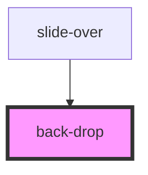

# back-drop

<!-- Auto Generated Below -->

## Properties

| Property  | Attribute | Description | Type      | Default |
| --------- | --------- | ----------- | --------- | ------- |
| `visible` | `visible` |             | `boolean` | `false` |

## Methods

### `hideBackdrop() => Promise<void>`

#### Returns

Type: `Promise<void>`

### `showBackdrop() => Promise<void>`

#### Returns

Type: `Promise<void>`

## Dependencies

### Used by

 - [slide-over](../slide-over)

### Graph

----------------------------------------------

*Built with [StencilJS](https://stenciljs.com/)*
