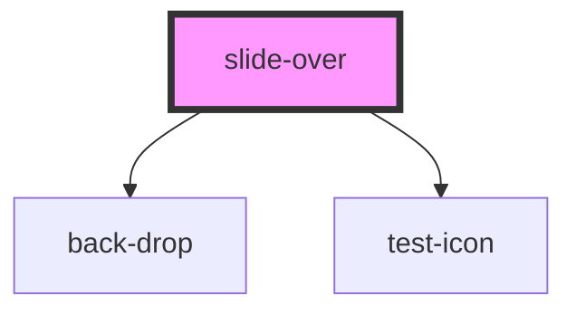

# my-component

<!-- Auto Generated Below -->

## Properties

| Property      | Attribute       | Description | Type      | Default     |
| ------------- | --------------- | ----------- | --------- | ----------- |
| `qaIdClose`   | `qa-id-close`   |             | `string`  | `undefined` |
| `qaIdElement` | `qa-id-element` |             | `string`  | `undefined` |
| `visible`     | `visible`       |             | `boolean` | `false`     |

## Events

| Event     | Description | Type               |
| --------- | ----------- | ------------------ |
| `close`   |             | `CustomEvent<any>` |
| `trigger` |             | `CustomEvent<any>` |

## Methods

### `handleClose() => Promise<void>`

#### Returns

Type: `Promise<void>`

### `handleTrigger() => Promise<void>`

#### Returns

Type: `Promise<void>`

## Dependencies

### Depends on

- [back-drop](../back-drop)
- [test-icon](../test-icon)

### Graph

----------------------------------------------

*Built with [StencilJS](https://stenciljs.com/)*
