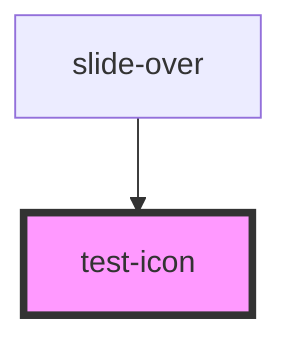

# test-icon

<!-- Auto Generated Below -->

## Properties

| Property      | Attribute       | Description | Type      | Default     |
| ------------- | --------------- | ----------- | --------- | ----------- |
| `icon`        | `icon`          |             | `"alert"` | `undefined` |
| `iconsize`    | `iconsize`      |             | `"md"`    | `undefined` |
| `icontype`    | `icontype`      |             | `"text"`  | `undefined` |
| `qaIdElement` | `qa-id-element` |             | `string`  | `undefined` |

## Dependencies

### Used by

 - [slide-over](../slide-over)

### Graph

----------------------------------------------

*Built with [StencilJS](https://stenciljs.com/)*
